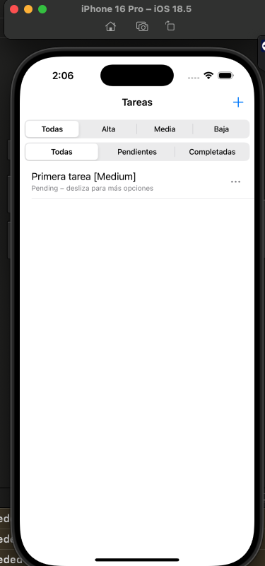
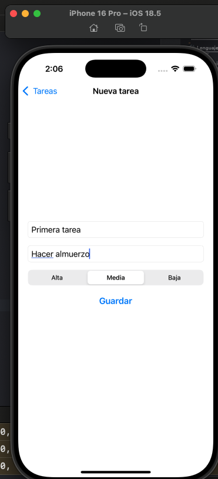
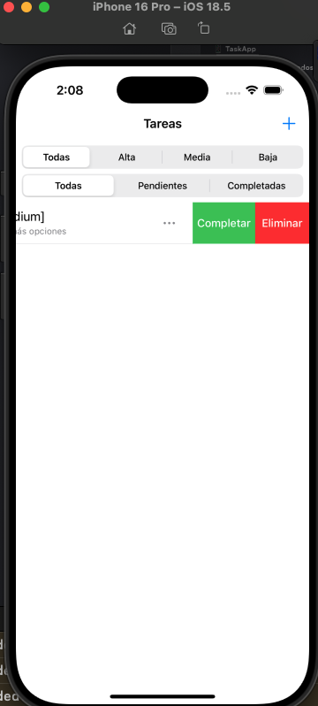
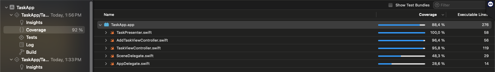

# 📱 TaskApp

Una aplicación iOS simple para gestionar tareas utilizando la arquitectura **MVP**.  
Permite **agregar, listar, filtrar, completar y eliminar tareas**, con validaciones y soporte de tests unitarios, de integración y de UI.

---

## 🛠️ Lenguaje y versión usados
- **Lenguaje:** Swift 5.9  
- **Framework:** UIKit  
- **Arquitectura:** MVP (Model-View-Presenter)  
- **Compatibilidad:** iOS 16+  
- **IDE:** Xcode 15+  

---

## 📦 Instrucciones de instalación
1. Clonar el repositorio:
   ```bash
   git clone https://github.com/CarlosMantillaC/FESC_TaskApp_2025.git
   cd TaskApp
   ```

2. Abrir el proyecto en Xcode:
   ```bash
   open TaskApp.xcodeproj
   ```

3. Seleccionar un simulador o dispositivo físico.

4. Ejecutar la app con:
   ```
   Cmd + R
   ```

---

## 🧪 Cómo ejecutar los tests

### Tests de integración (presenter)
1. En Xcode, ir a la pestaña **Test Navigator (⌘ + 6)**.  
2. Ejecutar la suite:
   - `TaskPresenterIntegrationTests` → Verifica agregar, validar, filtrar, completar y eliminar tareas.

### Tests de UI
1. Ejecutar la suite:
   - `TaskAppUITests` → Simula interacción real del usuario (agregar tarea, filtrar, deslizar para completar y eliminar).
2. También puedes correr todos los tests con:
   ```bash
   Cmd + U
   ```

---

## 📊 Resumen de resultados
- ✅ **Presenter Integration Tests**  
  - Validaciones de título vacío y prioridad inválida.  
  - Creación de tareas con estado pendiente por defecto.  
  - Filtros por prioridad y estado.  
  - Completar y eliminar tareas.  
  - Manejo de errores por ID inexistente.  

- ✅ **UI Tests**  
  - Navegación a "Agregar tarea".  
  - Creación de nueva tarea con título, descripción y prioridad.  
  - Filtrado por prioridad y estado.  
  - Swipe para completar y eliminar.  

---

## 🖼️ Capturas de pantalla

### Pantalla principal (lista de tareas)


### Pantalla de nueva tarea


### Swipe en tarea


### Cobertura del código probado

